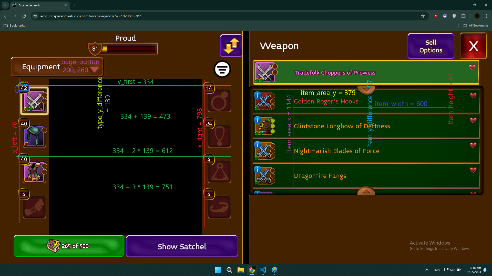
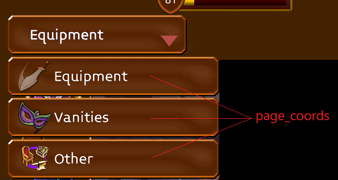

# Inventory Scanner
This is program scans items in your arcane legends inventory and lists them to a text file.
## Usage
```
python inventory.py [output file] [tradable]
```
if tradable argument is omitted or is not "tradable", all items will be listed.\
if output file argument is omitted, default output file is "itemlist.txt"\
## How it works
AL inventory consists of 3 pages: Equipment, Vanities and Other.\
These pages have some item types in them, for example in Equipment there are weapons or helmets etc.\
These types have count numbers displayed at their places.\
In short, the program looks at counts of each type, then loops through all of the items of that type, scans the area with the item name with Tesseract and jumps to next item either by mouse move or scroll.\
## Disclaimer
I don't recommend trying to make it work on your own screen but you are free to try at your own risk.\
## How to make it work
First of all you need to install python, tesseract\
then also pip install pytesserect, pyautogui, opencv-python\
So the code as it is works for: 1920x1080 screen, in chrome with bookmarks bar shown, AL with this resolution ?w=1920&h=911\
if you can set these, it might actually work straight away\
if you don't have those however, you need to adjust the numbers in the code to fit your screen loadout\
\
these are the variables and their values that I am using for my screen, if you have different loadout, you can take a screenshot of your inventory, paste it in paint, then navigate through each of these, note down the x, y values in lower left corner of paint and in python code rewrite the values to fit your screen\
x_left is x position of count boxes on the left (weapons, helmets..), y_right for right (rings, bracelets..)\
y_first is y position of first row count boxes (weapons, rings)\
type_y_difference is the gap between each row of types\
cw, ch are width and height of count boxes (in images folder you can see how count boxes look like after some manipulation)\
page_button is x, y of the main button that shows drop down menu of pages, use any position inside this button\
page_coords are individual page buttons, use any position inside them\
\
untradable_pixel well... this is basically position of single pixel that becomes red on the screen when an item is untradable otherwise is not red, on the next picture you can see which one I used (highlighted in green on the untradable icon) you can try using same one, tap on untradable item in your inventory, print fullscreen, paste into paint, move to that pixel with your cursor and in lower left corner you use those numbers in the untradable_pixel variable\
\
item_area_x is x position of item name\
item_area_y is y position of first item name\
item_width is width of item text area\
item_height is height of item text area\
item_y_difference is gap between each items from 1 roof of item area to next roof\
if you get all these right it should probably work, but I have not tested it on different screen.\
Use the scheme few images above